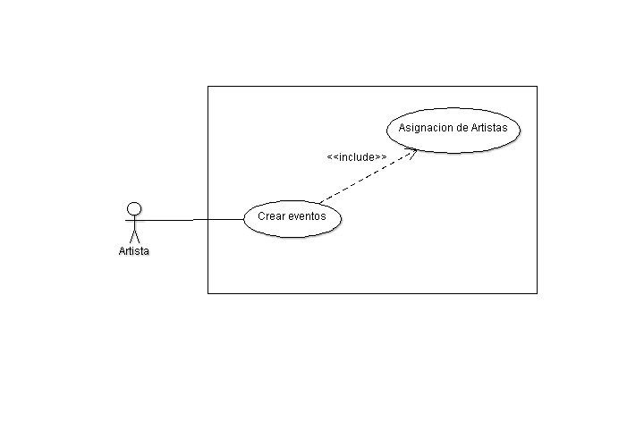
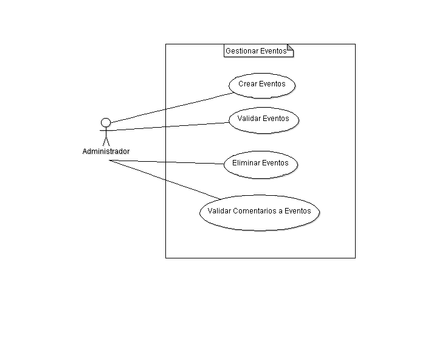
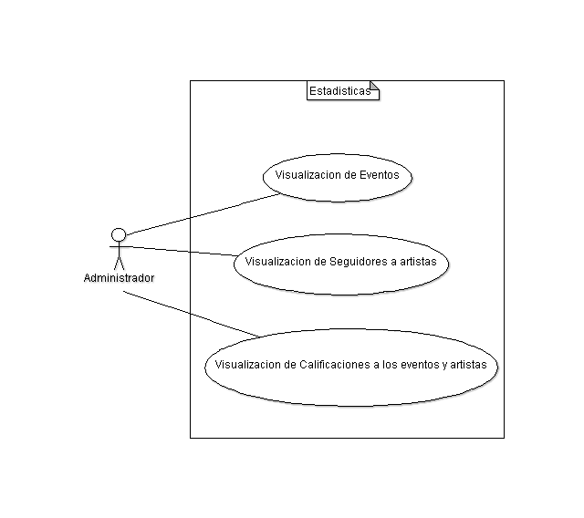

Diseño de la aplicacíon
=======================

Casos de Uso
------------

Se colocan los distintos casos de uso, tanto para la aplicación general como para
cada módulo.

.. image:: ../images/Usuario.png
   :scale: 80 %

.. image:: ../images/UsuarioComun.png
   :scale: 80 %

.. image:: ../images/Administrador.png
   :scale: 80 %

.. image:: ../images/GestionUsuarios.png
   :scale: 80 %

.. image:: ../images/CapsulaInformativas.png
   :scale: 80 %

.. image:: ../images/Directorio.png
   :scale: 80 %

Clases
------

Diagramas de clases y de sus distintas actividades, si fuese necesario.

Diagrama de BD
--------------

Diagrama de la Base de Datos que requerirá el software.
