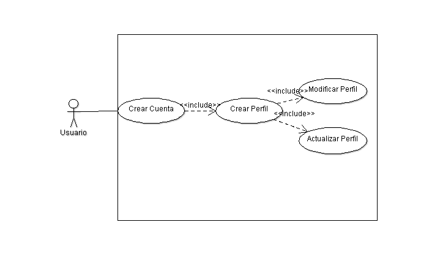
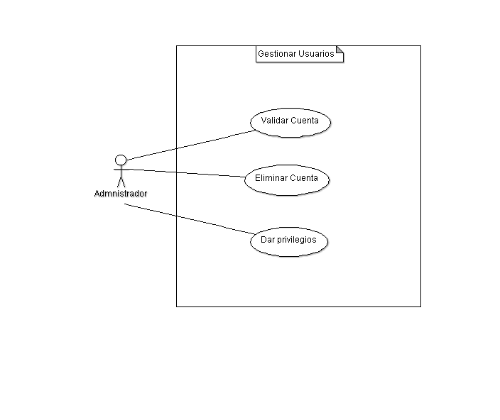
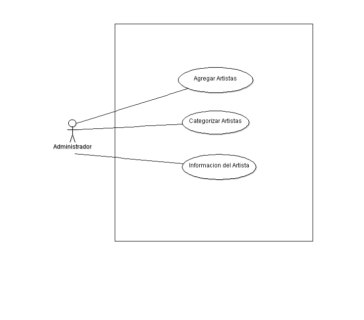

Diseño de la aplicacíon
=======================

Casos de Uso
------------

Se colocan los distintos casos de uso, tanto para la aplicación general como para
cada módulo.

   
.. image:: ../Diagramas/CasosDeUso/UsuarioComun.png
   
.. image:: ../Diagramas/CasosDeUso/Artista.png
   
.. image:: ../Diagramas/CasosDeUso/Administrador.png
   

   
.. image:: ../Diagramas/CasosDeUso/GestionEventos.png
   
.. image:: ../Diagramas/CasosDeUso/CapsulasInformativas.png
   
.. image:: ../Diagramas/CasosDeUso/Estadisticas.png
   

   

Clases
------

Diagramas de clases y de sus distintas actividades, si fuese necesario.

Diagrama de BD
--------------

