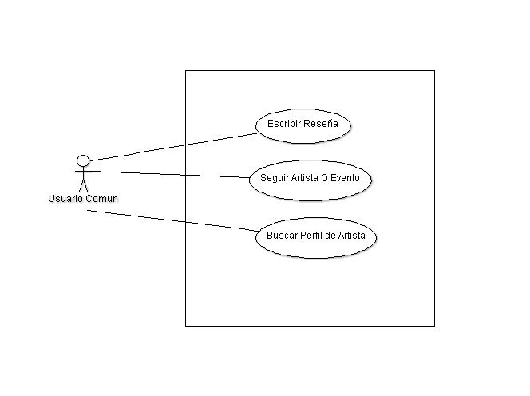
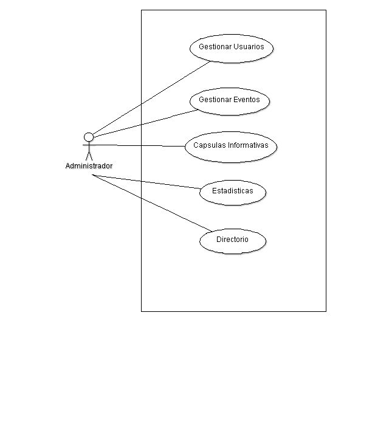
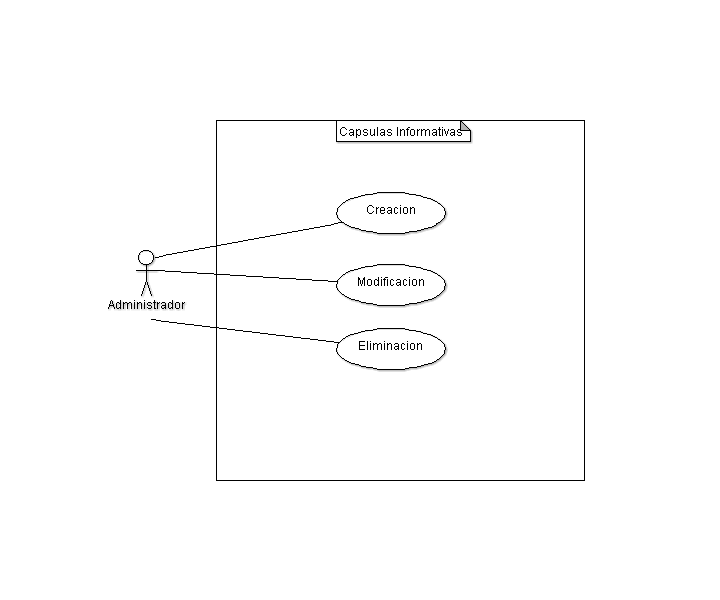
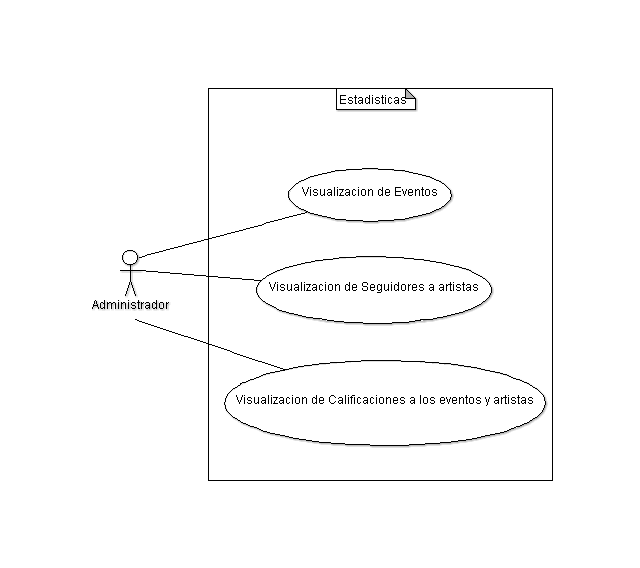
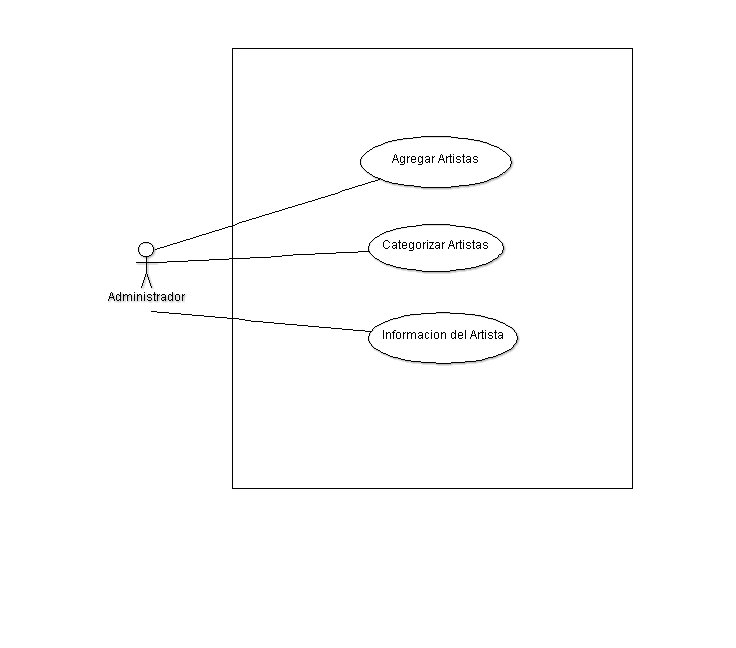

Diseño de la aplicacíon
=======================

Casos de Uso
------------

Se colocan los distintos casos de uso, tanto para la aplicación general como para
cada módulo.

.. image:: ../_static/Login.png
 :height: 10cm
 :width: 10cm

.. image:: ../_static/Usuario.png
   

   
.. image:: ../_static/Artista.png
   

   
.. image:: ../_static/GestionUsuarios.png
   
.. image:: ../_static/GestionEventos.png
   

   

   

   

Clases
------

Diagramas de clases y de sus distintas actividades, si fuese necesario.

Diagrama de BD
--------------

